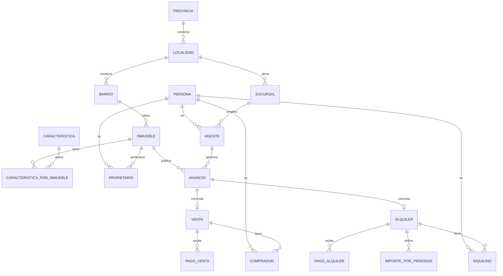

<div align="center">

#  Inmobiliaria — Data Modeling, Migración & BI

**De una tabla plana de ~90 columnas a un modelo relacional normalizado y un modelo estrella para análisis de negocio.**


*Proyecto académico · Gestión de Datos · UTN FRBA*

</div>

---

##  El problema

Una inmobiliaria tenía toda su operación en **una única tabla desnormalizada**: inmuebles, propietarios, anuncios, agentes, sucursales, ventas, alquileres, inquilinos y pagos, todo mezclado y repetido en cada fila.

El objetivo: convertir esos datos en una base **consistente**, **sin pérdidas ni duplicados**, y que sirva para **tomar decisiones**.


---

##  Tecnologías

| | |
|---|---|
| **Motor** | SQL Server 2019 |
| **Lenguaje** | T-SQL (DDL, DML, stored procedures, vistas) |
| **Herramientas** | SQL Server Management Studio |

---

##  Estructura del repositorio

| Archivo | Descripción |
|---|---|
|  `script_creacion_inicial.sql` | Esquema, tablas, claves, constraints y stored procedures de migración |
|  `script_creacion_BI.sql` | Modelo dimensional, carga de hechos y dimensiones, vistas de indicadores |
|  `verificacion.sql` | Controles post-migración: compara cantidades entre origen y destino |

---

##  Modelo transaccional



###  Decisiones de diseño

- ** Persona como entidad común**: agentes, propietarios, inquilinos y compradores comparten datos personales; los roles se modelan como relaciones.
- ** Catálogos** para todos los valores tipificados: tipo y estado de inmueble, moneda, medio de pago, orientación, disposición, ambientes, etc.
- ** Jerarquía de ubicación** Provincia → Localidad → Barrio, compartida por inmuebles y sucursales.
- ** Características como relación N:M**, en lugar de columnas booleanas fijas: agregar una nueva no requiere cambiar el esquema.
- ** El anuncio como eje**: ventas y alquileres se originan en un anuncio publicado.

---

##  Migración

1. Creación del esquema y de todas las tablas con sus constraints.
2. Carga de **catálogos y ubicación** (tablas sin dependencias).
3. Carga de **entidades principales** resolviendo claves foráneas.
4. Carga de **operaciones y pagos**.

>  Todo corre en **un único script**, de una sola vez, sobre una base limpia.
>  Los datos de origen **no se modifican**.

---

##  Modelo de BI

**Modelo estrella** cargado desde el modelo transaccional.

<details>
<summary><b> Dimensiones</b></summary>

<br>

| Dimensión | Detalle |
|---|---|
|  Tiempo | Año · cuatrimestre · mes |
|  Ubicación | Provincia · localidad · barrio |
|  Sucursal | — |
|  Rango etario | `< 25` · `25-35` · `35-50` · `> 50` |
|  Tipo de inmueble | — |
|  Ambientes | — |
|  Rango de superficie | `< 35` · `35-55` · `55-75` · `75-100` · `> 100` m² |
|  Tipo de operación | Alquiler · venta |
|  Moneda | — |

</details>

<details>
<summary><b> Indicadores (vistas)</b></summary>

<br>

-  Tiempo promedio de publicación de anuncios
-  Precio promedio por tipo de inmueble y superficie
-  Barrios más demandados para alquilar según la edad del inquilino
-  Morosidad en pagos de alquiler
-  Evolución del valor de los alquileres
-  Precio promedio del m² vendido
-  Comisiones promedio por sucursal
-  Tasa de conversión de anuncios en operaciones
-  Montos de cierre por sucursal y moneda

</details>

---

## ▶️ Cómo ejecutarlo

> [!NOTE]
> Requiere la base de datos de origen provista por la cátedra, que **no se incluye** en este repositorio.

```text
1. script_creacion_inicial.sql   → crea el modelo y migra los datos
2. script_creacion_BI.sql        → crea y carga el modelo de BI
3. verificacion.sql (opcional)   → valida la migración
```

---

<div align="center">

**Hecho por [Tu Nombre](https://www.linkedin.com/in/tu-usuario)** · 📫 tu@email.com

</div>
