# DER — Modelo transaccional

Diagrama generado a partir de los `CREATE TABLE` del procedure `creacionDatos`.
`PK` = clave primaria · `FK` = clave foránea · línea simple con círculo (`o`) = FK que admite NULL.

```mermaid
erDiagram
    %% ---------- Ubicación ----------
    Provincia ||--o{ Localidad : contiene
    Localidad ||--o{ Barrio : contiene
    Localidad |o--o{ Sucursal : ubica

    %% ---------- Inmueble ----------
    TipoInmueble ||--o{ Inmueble : clasifica
    Barrio |o--o{ Inmueble : ubica
    Ambientes |o--o{ Inmueble : tiene
    Orientacion |o--o{ Inmueble : tiene
    Disposicion |o--o{ Inmueble : tiene
    EstadoInmueble |o--o{ Inmueble : tiene
    Inmueble ||--o{ CaracteristicaPorInmueble : tiene
    Caracteristica ||--o{ CaracteristicaPorInmueble : aplica

    %% ---------- Personas y roles ----------
    Persona |o--o{ Agente : es
    Sucursal |o--o{ Agente : emplea
    Persona ||--o{ Propietario : es
    Inmueble ||--o{ Propietario : pertenece

    %% ---------- Anuncio ----------
    Inmueble |o--o{ Anuncio : publica
    Agente |o--o{ Anuncio : gestiona
    TipoOperacion |o--o{ Anuncio : tipo
    Moneda |o--o{ Anuncio : moneda
    EstadoAnuncio |o--o{ Anuncio : estado
    TiposPeriodosAnuncio |o--o{ Anuncio : periodo

    %% ---------- Alquiler ----------
    Anuncio |o--o{ Alquiler : origina
    EstadoAlquiler |o--o{ Alquiler : estado
    Alquiler ||--o{ ImportePorPeriodos : define
    Alquiler |o--o{ PagoAlquiler : recibe
    MedioDePago |o--o{ PagoAlquiler : medio
    Persona ||--o{ Inquilino : es
    Alquiler ||--o{ Inquilino : tiene

    %% ---------- Venta ----------
    Anuncio ||--o{ Venta : origina
    Moneda ||--o{ Venta : moneda
    Venta |o--o{ PagoVenta : recibe
    Moneda |o--o{ PagoVenta : moneda
    MedioDePago |o--o{ PagoVenta : medio
    Persona ||--o{ Comprador : es
    Venta ||--o{ Comprador : tiene

    Provincia {
        numeric provincia_codigo PK
        nvarchar provincia_detalle
    }
    Localidad {
        numeric localidad_codigo PK
        numeric localidad_provincia FK
        nvarchar localidad_detalle
    }
    Barrio {
        numeric barrio_codigo PK
        numeric barrio_localidad FK
        nvarchar barrio_detalle
    }
    Sucursal {
        numeric sucursal_codigo PK
        numeric sucursal_localidad FK
        nvarchar sucursal_detalle
        nvarchar sucursal_direccion
        nvarchar sucursal_telefono
    }
    TipoInmueble {
        numeric tipo_inmueble_codigo PK
        nvarchar tipo_inmueble_detalle
    }
    EstadoInmueble {
        numeric estado_inmueble_codigo PK
        nvarchar estado_inmueble_detalle
    }
    Ambientes {
        numeric ambientes_codigo PK
        nvarchar ambientes_detalle
    }
    Disposicion {
        numeric disposicion_codigo PK
        nvarchar disposicion_detalle
    }
    Orientacion {
        numeric orientacion_codigo PK
        nvarchar orientacion_detalle
    }
    Caracteristica {
        numeric caracteristica_codigo PK
        nvarchar caracteristica_detalle
    }
    Inmueble {
        numeric inmueble_codigo PK
        numeric inmueble_tipo FK
        numeric inmueble_barrio FK
        numeric inmueble_ambientes FK
        numeric inmueble_orientacion FK
        numeric inmueble_disposicion FK
        numeric inmueble_estado FK
        nvarchar inmueble_nombre
        nvarchar inmueble_descripcion
        nvarchar inmueble_direccion
        numeric inmueble_superficie
        numeric inmueble_antiguedad
        numeric inmueble_expensas
    }
    CaracteristicaPorInmueble {
        numeric caracInmueble_caracteristica PK, FK
        numeric caracInmueble_inmueble PK, FK
    }
    Persona {
        numeric persona_codigo PK
        nvarchar persona_nombre
        nvarchar persona_apellido
        char persona_dni
        smalldatetime persona_fecha_registro
        nvarchar persona_telefono
        nvarchar persona_mail
        smalldatetime persona_fecha_nacimiento
    }
    Agente {
        numeric agente_codigo PK
        numeric agente_persona FK
        numeric agente_sucursal FK
    }
    Propietario {
        numeric propietario_persona PK, FK
        numeric propietario_inmueble PK, FK
    }
    Moneda {
        numeric moneda_codigo PK
        nvarchar moneda_detalle
    }
    MedioDePago {
        numeric medioDePago_codigo PK
        nvarchar medioDePago_detalle
    }
    TiposPeriodosAnuncio {
        numeric tipoPeriodo_codigo PK
        nvarchar tipoPeriodo_detalle
    }
    EstadoAnuncio {
        numeric estadoAnuncio_codigo PK
        nvarchar estadoAnuncio_Detalle
    }
    TipoOperacion {
        numeric tipoOperacion_codigo PK
        nvarchar tipoOperacion_detalle
    }
    Anuncio {
        numeric anuncio_codigo PK
        numeric anuncio_tipoOperacion FK
        numeric anuncio_moneda FK
        numeric anuncio_inmueble FK
        numeric anuncio_agente FK
        numeric anuncio_estadoAnuncio FK
        numeric anuncio_tipoPeriodo FK
        smalldatetime anuncio_fechaPublicacion
        numeric anuncio_precioPublicado
        numeric anuncio_costoAnuncio
        smalldatetime anuncio_fechaFinalizacion
    }
    EstadoAlquiler {
        numeric estado_alquiler_codigo PK
        nvarchar estado_alquiler_detalle
    }
    Alquiler {
        numeric alquiler_codigo PK
        numeric alquiler_anuncio_codigo FK
        numeric alquiler_estado FK
        smalldatetime alquiler_fecha_inicio
        smalldatetime alquiler_fecha_fin
        numeric alquiler_cantidad_periodos
        numeric alquiler_deposito
        numeric alquiler_comision
        numeric alquiler_gastos_averiguaciones
    }
    ImportePorPeriodos {
        numeric ip_alquiler_codigo PK, FK
        numeric ip_nroPeriodoInicio PK
        numeric ip_nroPeriodoFin PK
        numeric ip_precio
    }
    PagoAlquiler {
        numeric pagoAlquiler_codigo PK
        numeric pagoAlquiler_alquiler FK
        numeric pagoAlquiler_medioDePago FK
        smalldatetime pagoAlquiler_fechaPago
        numeric pagoAlquiler_nroPeriodo
        nvarchar pagoAlquiler_detallePeriodo
        smalldatetime pagoAlquiler_fechaInicioPeriodo
        smalldatetime pagoAlquiler_fechaFinPeriodo
        numeric pagoAlquiler_importe
    }
    Inquilino {
        numeric inquilino_persona PK, FK
        numeric inquilino_alquiler PK, FK
    }
    Venta {
        numeric venta_codigo PK
        numeric venta_moneda FK
        numeric venta_anuncio FK
        smalldatetime venta_fecha
        numeric venta_comision
        numeric venta_precio
    }
    Comprador {
        numeric comprador_venta PK, FK
        numeric comprador_persona PK, FK
    }
    PagoVenta {
        numeric pagoVenta_codigo PK
        numeric pagoVenta_venta FK
        numeric pagoVenta_moneda FK
        numeric pagoVenta_medioDePago FK
        numeric pagoVenta_importe
        numeric pagoVenta_cotizacion
    }
```

